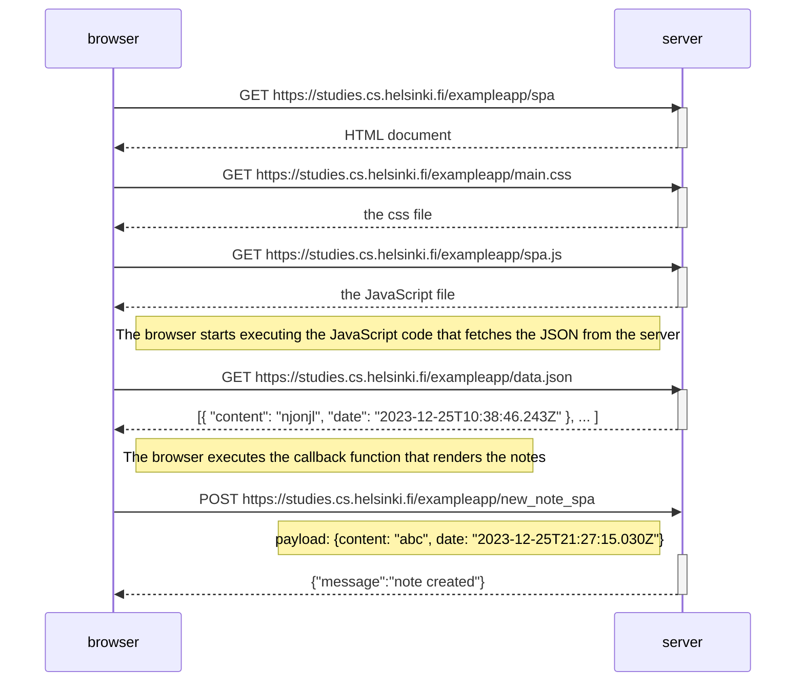

User creates a new note on Single-page app version of the notes app 

```mermaid
sequenceDiagram
    participant browser
    participant server

    browser->>server: GET https://studies.cs.helsinki.fi/exampleapp/spa
    activate server
    server-->>browser: HTML document
    deactivate server

    browser->>server: GET https://studies.cs.helsinki.fi/exampleapp/main.css
    activate server
    server-->>browser: the css file
    deactivate server

    browser->>server: GET https://studies.cs.helsinki.fi/exampleapp/spa.js
    activate server
    server-->>browser: the JavaScript file
    deactivate server

    Note right of browser: The browser starts executing the JavaScript code that fetches the JSON from the server

    browser->>server: GET https://studies.cs.helsinki.fi/exampleapp/data.json
    activate server
    server-->>browser: [{ "content": "njonjl", "date": "2023-12-25T10:38:46.243Z" }, ... ]
    deactivate server

    Note right of browser: The browser executes the callback function that renders the notes


    browser->>server: POST https://studies.cs.helsinki.fi/exampleapp/new_note_spa 
    Note left of server: payload: {content: "abc", date: "2023-12-25T21:27:15.030Z"} 
    activate server
    server-->>browser: {"message":"note created"}
    deactivate server

```
